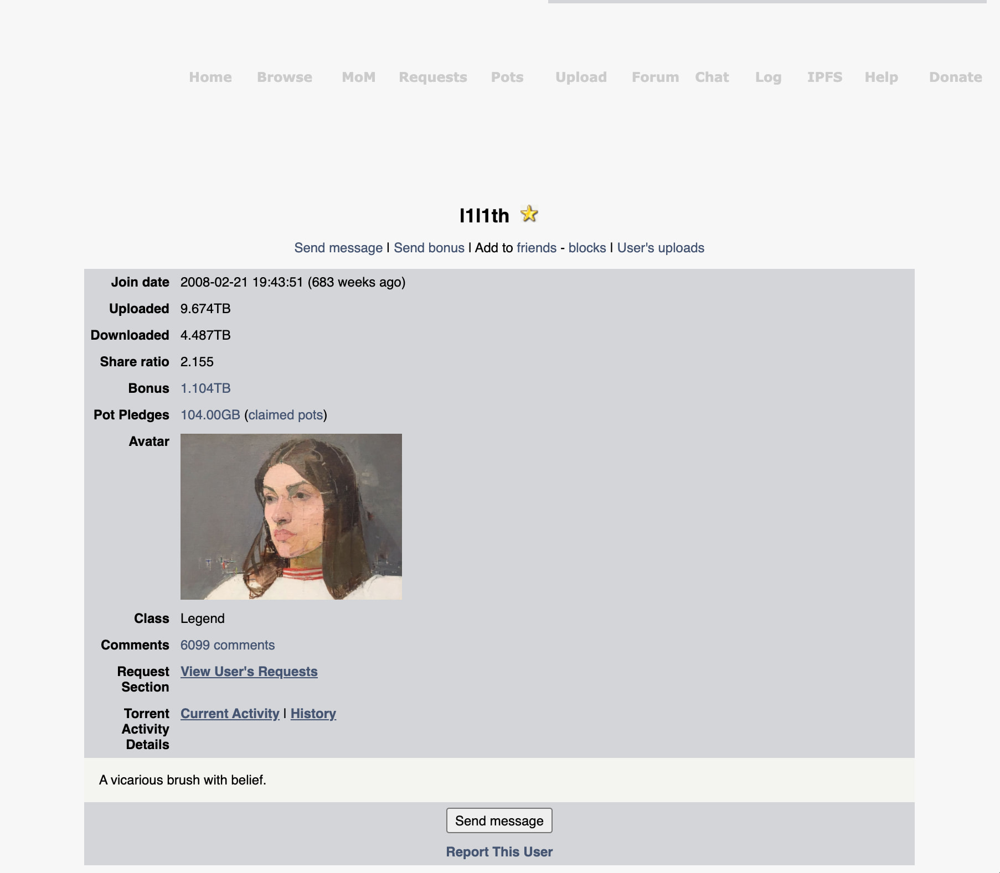
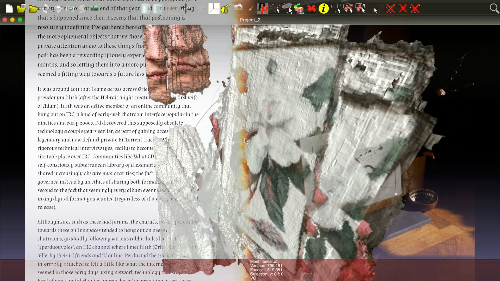

# l1l1th

l1l1th.net is an artwork produced for Wysing Arts Centre in Bourn, Cambridge, as part of their 2020 AMPlify Residency.

  

#### About AMPlify
AMPlify is an alternative learning programme for artists aged 18 to 25 years to test new approaches and ideas through workshops and talks, whilst also having time to develop their own work. In 2020/21 AMPlify took place entirely online, to explore how digital tools and games can be used to create and develop future visions of the world.

The 10 artists who took part in AMPlify this year were Lauren Clifford-Keane, [Kelly Emelle](https://kellyemelle.myportfolio.com/), Jules Fennell, [Poppy Jones-Little](https://www.poppyjoneslittle.com/), [Lucie MacGregor](https://www.luciemacgregor.com/), Rosemary Moss, [Alexis Parinas](https://alexisparinas.com/), [Johanna Saunderson](https://johannasaunderson.com/), O. S. Warren and [Frances Whorrall-Campbell](https://docs.google.com/document/d/1Q5Q-3hFHMW0Q_xP_ZPOzijciHBZNBxjE7-PJ0moo2Bc). The work spans a range of topics and perspectives around identities and experiments in media across animation, video, sound and interactive work.

The participating artists were supported by contributing and mentoring artists Danielle Brathwaite-Shirley, Anna Bunting-Branch and Robin Buckley (rkss) and mentoring artists Laura Fox and Harold Offeh.
